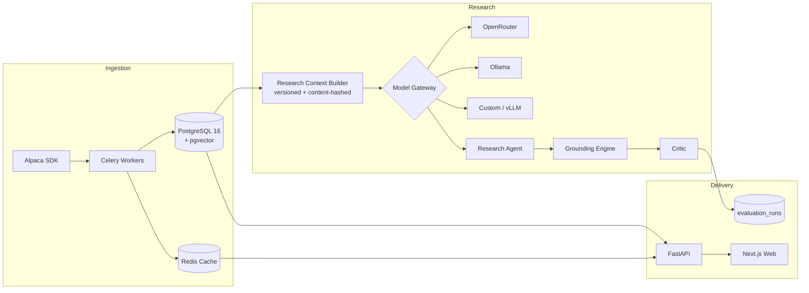

# Agnostix AI Quant Fund

**An AI-driven quantitative research platform where every insight is traceable, every claim is grounded, and no trade executes without a human.**

LLM research agents generate structured investment theses from real market and fundamental data — checked by deterministic grounding engines, benchmarked across model providers on identical contexts, and gated behind a mandatory human approval step.

---

## Highlights

- **Market intelligence** — bars, quotes, trades, and news ingested from Alpaca with full provenance (`provider / event_time / received_at / stored_at`) and discrete freshness states (`FRESH / STALE / MISSING / INVALID`) on every record
- **Fundamental intelligence** — company profiles, financials, earnings, and valuation snapshots with deterministic derived metrics (growth, margins, FCF, surprises), each carrying formula + inputs provenance
- **AI research agent** — produces structured `InvestmentThesis` output: view, confidence, catalysts, risks, bear case, and explicit invalidation conditions
- **Deterministic critic** — evidence existence, numerical traceability, and calibration checks are authoritative; an optional LLM reviewer can only *escalate*, never downgrade
- **Multi-model evaluation harness** — every provider/model is evaluated against *one immutable context* (same version + hash), recording latency, tokens, cost, schema validity, and critic verdicts per run
- **Provider-agnostic Model Gateway** — OpenRouter, OpenAI, Anthropic, Ollama (local), and any self-hosted OpenAI-compatible endpoint behind one registry; domain code has zero provider imports (test-enforced)
- **Autonomous options trading desk** — the LLM proposes a direction + thesis; deterministic code builds a defined-risk strategy (bull put / bear call / iron condor / cash-secured put), sizes it, runs ten pure-math risk gates, and executes on Alpaca paper. Every decision, refusal, and order is hash-chained into a tamper-evident journal.
- **Interactive war room + playground** — live equity curve, open strategies, kill switch, and a "challenge the agent" playground that streams the agent's full reasoning (market → signal → strategy → risk gates → verdict) over SSE, with injectable what-if scenarios.

---

## Architecture



The agent pipeline enforces a fixed execution chain — `Signal → Critic → Risk → Human Approval → Execution` — implemented as a LangGraph state machine with an interrupt-based human gate. **No edge bypasses the gate**, and risk decisions are deterministic-only (an LLM never decides there).

## Repository Layout

```
├── apps/
│   ├── api/            # FastAPI app: routes, Celery workers, DB models
│   └── web/            # Next.js 14 frontend (markets watchlist, charts, news)
├── packages/
│   └── types/          # Shared TypeScript contracts mirroring internal schemas
├── services/
│   ├── market_data/    # Normalization, validation, freshness, snapshots
│   ├── fundamentals/   # Schemas, metrics, providers, research agent/critic
│   ├── news/           # News normalization
│   ├── model_gateway/  # Provider registry + adapters (6 providers)
│   ├── agents/         # LangGraph pipeline skeleton + role permissions
│   ├── evaluation/     # Multi-model evaluation harness
│   ├── backtesting/    # (reserved)
│   ├── portfolio/      # (reserved)
│   ├── risk/           # (reserved, M5)
│   └── execution/      # (reserved, M7 — paper only)
├── db/                 # Alembic migrations + seeds
├── infra/docker/       # api.Dockerfile, web.Dockerfile
└── docs/               # Architecture + development guides
```

## Tech Stack

| Layer | Technology |
|---|---|
| Backend | Python 3.12, FastAPI, Pydantic v2, Uvicorn |
| Storage | PostgreSQL 16 (pgvector), SQLAlchemy 2 async, asyncpg, Alembic |
| Async / cache | Redis 7, Celery |
| AI orchestration | LangGraph, provider-agnostic Model Gateway |
| Market data | alpaca-py (paper trading / IEX feed only) |
| Frontend | Next.js 14, React 18, TypeScript 5, TailwindCSS, Zustand, TanStack Query, lightweight-charts |
| Quality | Ruff (+ bandit rules), mypy, pytest, Vitest, Testing Library |
| Infra | Docker Compose, GitHub Actions CI |

## Quickstart (Docker)

Prerequisites: Docker, Python 3.12, Node 20.

```bash
git clone <repo-url> && cd agnostix-ai-quant-fund

cp .env.example .env          # then edit .env and add your keys (below)
make dev                      # docker compose up --build (postgres, redis, api, worker, web)
```

In a second terminal, apply migrations + seed:

```bash
make migrate                  # alembic upgrade head
make seed
```

| Service | URL |
|---|---|
| Web frontend | http://localhost:3000 |
| Trading War Room | http://localhost:3000/trading |
| Interactive Playground | http://localhost:3000/playground |
| API | http://localhost:8000 |
| API docs | http://localhost:8000/docs |

### Run without Docker

```bash
python3.12 -m venv .venv && source .venv/bin/activate
pip install -r requirements.txt
cp .env.example .env          # add keys
docker compose up -d postgres redis   # you still need the data stores
make migrate
make seed
uvicorn app.main:app --reload --app-dir apps/api --port 8000   # terminal 1
cd apps/web && npm install && npm run dev                      # terminal 2
```

### Smoke test

```bash
curl -s http://localhost:8000/health
curl -s http://localhost:8000/trading/status
python -m infra.scripts.agnostix status      # desk status via CLI
```

## Configuration

All config flows through environment variables (see `.env.example`). **The API reads every setting with the `API_` prefix** (`app/core/config.py` uses `env_prefix="API_"`) — plain `ALPACA_API_KEY` or `OPENROUTER_API_KEY` are ignored.

The minimum working `.env`:

```bash
# LLM — OpenRouter free tier works (use any ":free" model id)
API_OPENROUTER_API_KEY=sk-or-v1-...
API_OPENROUTER_MODEL=deepseek/deepseek-chat-v3-0324:free
# ...or any one of: API_OPENAI_API_KEY / API_ANTHROPIC_API_KEY / API_OLLAMA_BASE_URL

# Alpaca — PAPER TRADING ONLY (fresh $100k paper account)
API_ALPACA_API_KEY=<paper key id>
API_ALPACA_SECRET_KEY=<paper secret>
API_ALPACA_PAPER=true
```

| Group | Variables |
|---|---|
| Database / Redis | `API_DATABASE_URL`, `API_REDIS_URL` |
| Alpaca (paper) | `API_ALPACA_API_KEY`, `API_ALPACA_SECRET_KEY`, `API_ALPACA_PAPER=true`, `API_ALPACA_MCP_URL` *(server-side only, never exposed to the frontend)* |
| Model Gateway | `API_OPENROUTER_API_KEY` + `API_OPENROUTER_MODEL`, `API_OPENAI_API_KEY`, `API_ANTHROPIC_API_KEY`, `API_OLLAMA_BASE_URL` — gateway uses whichever is set |
| Security | `AUTH_SECRET`, `API_PROVIDER_ENCRYPTION_KEY` (Fernet key for provider credentials at rest) |

## Common Commands

```bash
make dev         # start full stack (postgres, redis, api, worker, web)
make migrate     # apply DB migrations
make seed        # seed database
make test        # pytest (unit + integration layout)
make lint        # ruff check + mypy
make format      # ruff format + autofix
make typecheck   # TypeScript, apps/web
```

### Trading desk CLI

```bash
python -m infra.scripts.agnostix status            # desk status + account
python -m infra.scripts.agnostix chain SPY         # enriched option chain
python -m infra.scripts.agnostix decide AAPL       # one decision (dry-run)
python -m infra.scripts.agnostix decide AAPL --execute   # place a paper order
python -m infra.scripts.agnostix run SPY AAPL      # run a cycle
python -m infra.scripts.agnostix journal --verify  # verify the hash-chained ledger
python -m infra.scripts.agnostix kill              # engage the kill switch
```

## Roadmap

| Milestone | Scope | Status |
|---|---|---|
| M0 | Foundation: infra, CI, auth scaffolding | ✅ Done |
| M1 | Market intelligence: ingestion, provenance, freshness, `/markets` UI | ✅ Done |
| M2 | Fundamental AI intelligence: research agent, critic, gateway, evaluation harness | ✅ Done |
| M3 | Signal agents producing `TradeProposal`s | 🔜 Next |
| M4 | Human approval gate wiring | Planned |
| M5 | Deterministic quant risk engine | ✅ Done (options risk gates) |
| M6 | Portfolio construction | Partial — desk book + equity snapshots |
| M7 | Paper execution via broker abstraction | ✅ Done (options: chains, MLEG, paper) |

## Design Principles

1. **Provenance everywhere** — every data record carries its source and timestamps; missing or stale inputs become explicit data gaps, never fabricated values
2. **Conflicts preserved, never silently corrected** — validation flags quality issues instead of mutating data
3. **Deterministic checks outrank LLM opinions** — grounding and risk logic are rule-based; LLM reviewers can escalate but never downgrade a verdict
4. **Human-in-the-loop by architecture** — the LangGraph interrupt point makes approval structurally unavoidable
5. **No live capital** — paper trading only; `ALPACA_PAPER=false` is hard-refused at adapter construction
6. **Lean dependencies** — ML/RL libraries (PyTorch, XGBoost, vectorbt…) join only when their milestone begins
